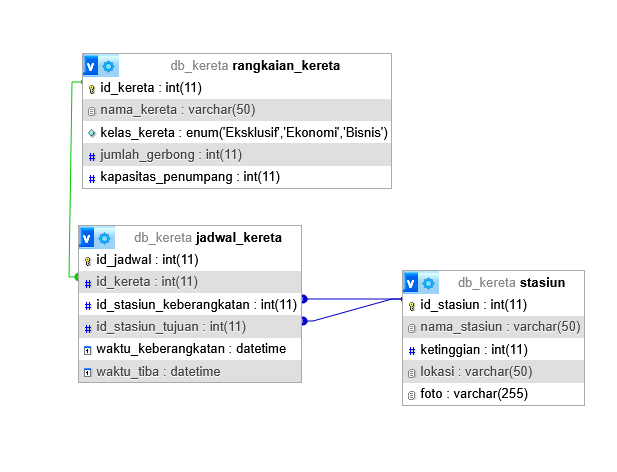
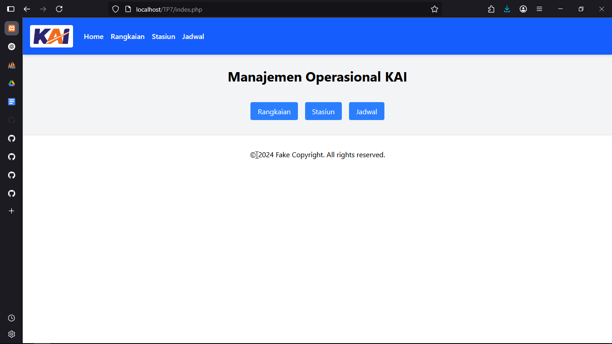
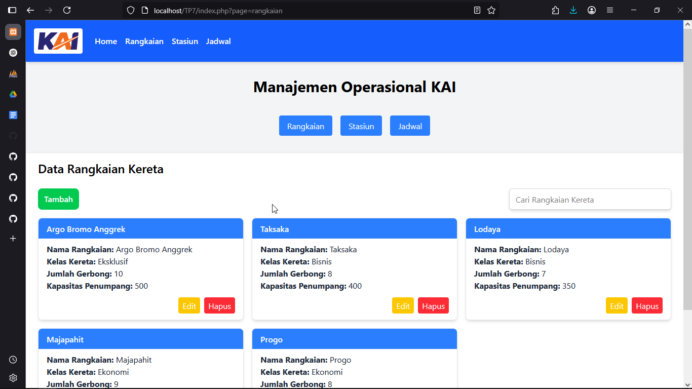

# Janji
Saya Putra Hadiyanto Nugroho dengan NIM 2308163 mengerjakan Tugas Praktikum 7 dalam mata kuliah Desain dan Pemrograman Berorientasi Objek untuk keberkahanNya maka saya tidak melakukan kecurangan seperti yang telah dispesifikasikan. Aamiin.

# Deskripsi
Program ini merupakan aplikasi manajemen penjadwalan dan pengelolaan data stasiun, kereta api. Program ini berfungsi sebgai CRUD untuk data rangkaian kereta, stasiun, dan jadwal perjalanan. Program ini dibangun menggunakan PHP dan MySQL sebagai database. Untuk frontend menggunakan HTML, Tailwind, dan sedikit Javascript. 

# Fitur
1. **Manajemen Rangkaian Kereta**:
   - Tambah, lihat, edit, dan hapus data rangkaian kereta.
   - Data meliputi nama kereta, kelas kereta, jumlah gerbong, dan kapasitas penumpang.

2. **Manajemen Stasiun**:
   - Tambah, lihat, edit, dan hapus data stasiun.
   - Data meliputi nama stasiun, lokasi, ketinggian, dan foto stasiun.

3. **Manajemen Jadwal Kereta**:
   - Tambah, lihat, edit, dan hapus jadwal perjalanan kereta.
   - Data meliputi nama kereta, stasiun keberangkatan, stasiun tujuan, waktu keberangkatan, dan waktu tiba.

4. **Pencarian Data**:
   - Fitur pencarian untuk rangkaian kereta, stasiun, dan jadwal perjalanan.

5. **Pengelolaan Gambar**:
   - Upload dan pengelolaan gambar untuk data stasiun.

6. **Notifikasi**:
   - Menampilkan pesan sukses atau gagal saat melakukan operasi CRUD.

# Alur Program
### 1. Halaman Utama
Halaman utama aplikasi ini adalah `index.php`. Pada halaman ini terdapat menu navigasi untuk mengakses halaman manajemen rangkaian kereta, stasiun, dan jadwal kereta.

### 2. Halaman Manajemen Rangkaian Kereta
Pada halaman ini data rangkaian kereta ditampilkan dalam format card. User dapat menambah, mengedit, dan menghapus data rang
kaian kereta.
- **Create/Add**, Untuk menambah data rangkaian kereta, user akan diarahkan ke halaman `add_rangkaian.php`. Setelah mengisi form dan menekan tombol simpan, data akan disimpan ke dalam database melalui file `rangkaian_handler.php`. Jika berhasil, user akan diarahkan kembali ke halaman manajemen rangkaian kereta dengan pesan sukses. Jika gagal, akan ditampilkan pesan gagal.
- **Read/View**, Untuk melihat data rangkaian kereta, user dapat melihatnya pada halaman `rangkaian.php`. Data ditampilkan dalam format card dengan informasi nama kereta, kelas kereta, jumlah gerbong, dan kapasitas penumpang.
- **Update/Edit**, Untuk mengedit data rangkaian kereta, user dapat mengklik tombol edit pada card yang sesuai. User akan diarahkan ke halaman `edit_rangkaian.php` untuk mengedit data. Setelah mengisi form dan menekan tombol simpan, data akan diperbarui di dalam database melalui file `rangkaian_handler.php`. Jika berhasil, user akan diarahkan kembali ke halaman manajemen rangkaian kereta dengan pesan sukses. Jika gagal, akan ditampilkan pesan gagal.
- **Delete**, Untuk menghapus data rangkaian kereta, user dapat mengklik tombol hapus pada card yang sesuai. Setelah mengkonfirmasi penghapusan, data akan dihapus dari database melalui file `rangkaian_handler.php`. Jika berhasil, user akan diarahkan kembali ke halaman manajemen rangkaian kereta dengan pesan sukses. Jika gagal, akan ditampilkan pesan gagal.

### 3. Halaman Manajemen Stasiun
Halaman manajemen stasiun mirip dengan halaman manajemen rangkaian kereta. User dapat menambah, mengedit, dan menghapus data stasiun. Alur kerja sama dengan halaman manajemen rangkaian kereta, hanya saja data yang ditampilkan adalah data stasiun dan terdapat foto stasiun.

### 4. Halaman Manajemen Jadwal Kereta
Halaman manajemen jadwal kereta juga mirip dengan halaman manajemen rangkaian kereta. User dapat menambah, mengedit, dan menghapus data jadwal kereta. Alur kerja sama dengan halaman manajemen rangkaian kereta, hanya saja data yang ditampilkan adalah data jadwal kereta. Perbedaan terletak pada form tambah dan edit jadwal kereta, di mana user harus memilih rangkaian kereta dan stasiun keberangkatan serta tujuan dari data yang sudah ada.

# Rancangan Program
## Rancangan Database

1. **Rangkaian Kereta**: Tabel ini menyimpan data rangkaian kereta yang terdiri dari `id_kereta`, `nama_kereta`, `kelas_kereta`, `jumlah_gerbong` dan `kapasitas penumpang`.
2. **Stasiun**: Tabel ini menyimpan data stasiun yang terdiri dari `id_stasiun`, `nama_stasiun`, `lokasi`, `ketinggian`, dan `foto`.
3. **Jadwal Kereta**: Tabel ini menyimpan data jadwal perjalanan yang terdiri dari `id_jadwal`, `id_kereta`, `id_stasiun_keberangkatan`, `id_stasiun_tujuan`, `waktu_keberangkatan`, `waktu_tiba`.

## Modularisasi
```
struktur folder

code/
├── class/
│   ├── Jadwal_kereta.php
│   ├── Rangkaian_kereta.php
│   └── Stasiun.php
├── config/
│   └── db.php
├── css/
│   └── style.css
├── database/
│   └── db_kereta.sql
├── handler/
│   ├── jadwal_handler.php
│   ├── rangkaian_handler.php
│   └── stasiun_handler.php
├── images/
│   ├── bandung.jpg
│   ├── gambir.jpg
│   ├── kai.png
│   ├── malang.jpg
│   ├── pasarsenen.jpg
│   ├── solobalapan.jpg
│   ├── surabaya.jpg
│   └── yogyakarta.jpg
├── tailwind/
│   └── input.css
├── view/
│   ├── add_jadwal.php
│   ├── add_rangkaian.php
│   ├── add_stasiun.php
│   ├── edit_jadwal.php
│   ├── edit_rangkaian.php
│   ├── edit_stasiun.php
│   ├── header.php
│   ├── jadwal.php
│   ├── rangkaian.php
│   └── stasiun.php
└── index.php
```
Dari struktur folder di atas, dapat dilihat bahwa aplikasi ini memanfaatkan modularisasi dengan memisahkan setiap bagian aplikasi ke dalam folder yang berbeda. Folder `class` berisi kelas-kelas yang digunakan untuk mengelola data, folder `config` berisi konfigurasi database, folder `handler` berisi file untuk menangani operasi CRUD, folder `view` berisi file tampilan.

### Penggunaan Prepared Statement dan PDO
Aplikasi ini menggunakan PDO (PHP Data Objects) untuk mengakses database MySQL.  Contoh penggunaan prepared statement pada file class `Rangkaian_kereta.php`:
```php
    public function getAllRangkaianKereta() {
        $stmt = $this->conn->query("SELECT * FROM rangkaian_kereta");
        return $stmt->fetchAll(PDO::FETCH_ASSOC);
    }
```

# Teknologi yang Digunakan
- **PHP**: Bahasa pemrograman yang digunakan untuk backend aplikasi ini.
- **MySQL**: Database yang digunakan untuk menyimpan data rangkaian kereta, stasiun, dan jadwal perjalanan.
- **HTML**: Digunakan untuk membuat struktur halaman web.
- **Tailwind CSS**: Digunakan untuk mempercantik tampilan halaman web.

# Dokumentasi




[https://github.com/putrahadiyanto/TP7DPBO2025C1/issues/1#issue-3007033351](https://github.com/user-attachments/assets/9507baee-66a9-4985-b5a3-9dacbec06e77)
